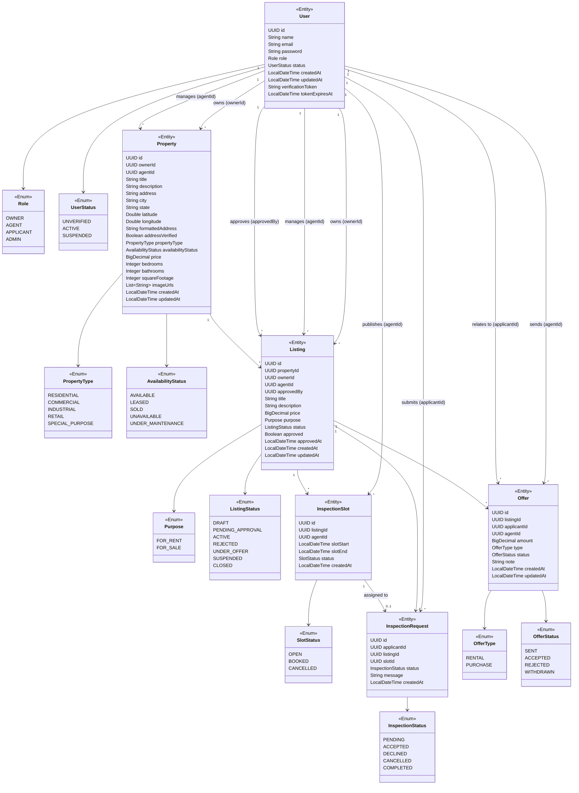

# EstateLink — Class Diagram

> Render this file in any Markdown viewer that supports Mermaid (VS Code, GitHub, IntelliJ, etc.).



---

### Plain-text description (for non-Mermaid contexts)

```
User
 ├── owns → Property[] (ownerId)
 ├── manages → Property[] (agentId)
 ├── owns → Listing[] (ownerId)
 ├── manages → Listing[] (agentId)
 ├── approves → Listing[] (approvedBy)
 ├── submits → InspectionRequest[] (applicantId)
 ├── publishes → InspectionSlot[] (agentId)
 ├── sends → Offer[] (agentId)
 └── relates to → Offer[] (applicantId)

Property
 ├── type → PropertyType
 ├── availability → AvailabilityStatus
 └── listings → Listing[]

Listing
 ├── property → Property
 ├── purpose → Purpose
 ├── status → ListingStatus
 ├── slots → InspectionSlot[]
 ├── requests → InspectionRequest[]
 └── offers → Offer[]

InspectionSlot
 ├── listing → Listing
 ├── agent → User
 └── assigned request → InspectionRequest (0..1)

InspectionRequest
 ├── applicant → User
 ├── listing → Listing
 └── slot → InspectionSlot

Offer
 ├── listing → Listing
 ├── agent → User
 └── applicant → User
```
